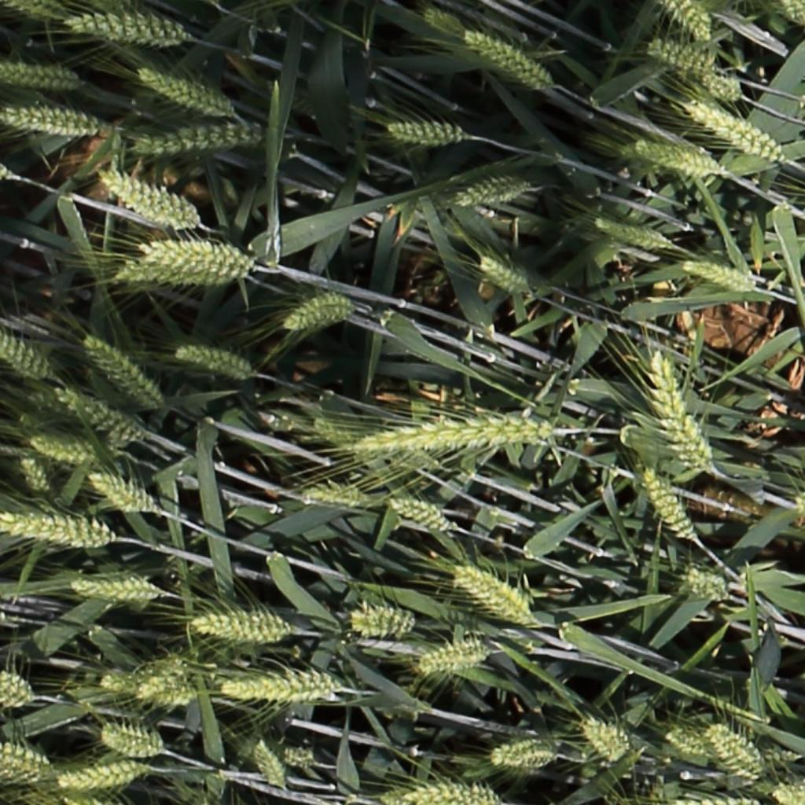
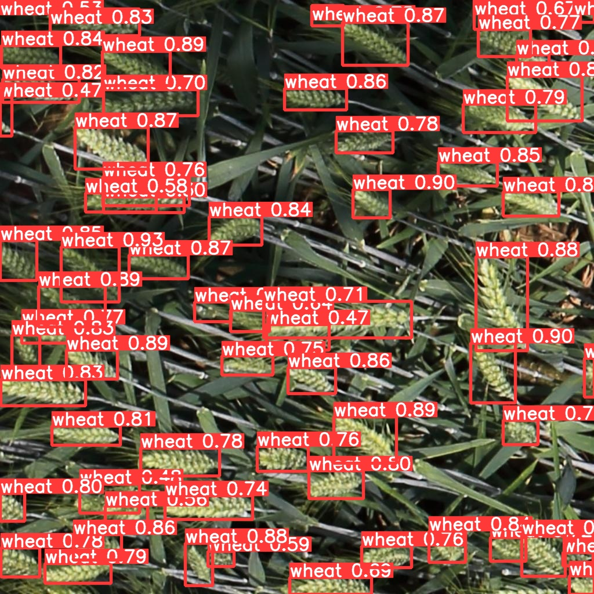
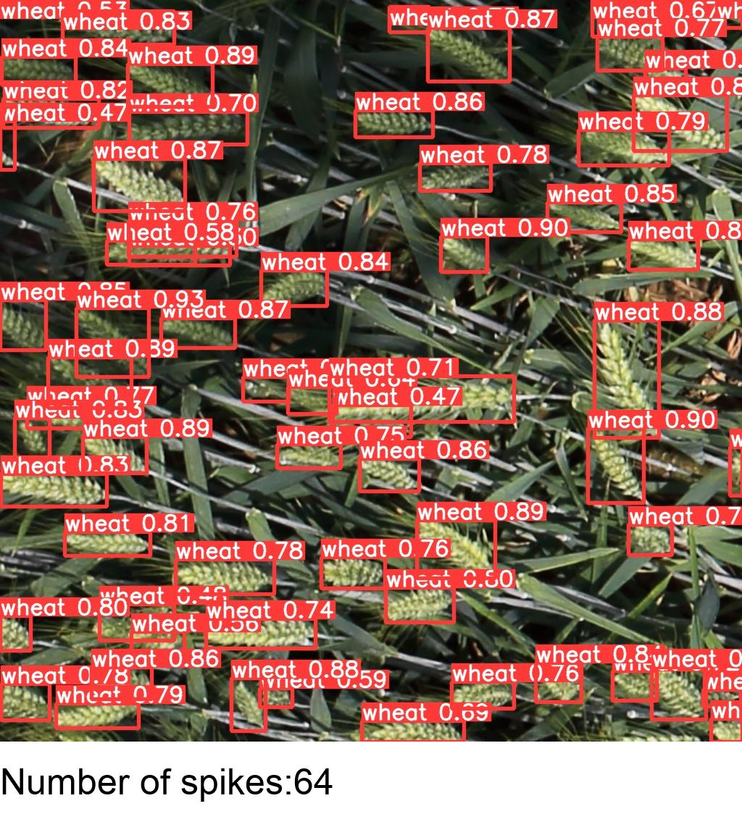

# 麦穗计数

## 环境配置：
* Python 推荐3.8.5（3.8以上）
* Pytorch 推荐1.10.0
* 详细环境配置见`requirements.txt`

## 文件结构：
```
├── wheat: 工程文件
      ├── checkpoints: 存放已经训练好的权重
      ├── data: 数据集相关设置
      ├── models: 训练模型存放文件
      ├── pretrained: 存放预训练权重文件
      ├── network_files: Faster R-CNN网络（包括Fast R-CNN以及RPN等模块）
      ├── results: 存放预测结果
      ├── runs: 存放训练过程日志、记录
      ├── test: 用于存放测试的图片
      ├── utils: 训练验证相关模块
      ├── predict.py: 简易的预测脚本，使用训练好的权重进行预测测试
      ├── train.py: 用于训练模型
      └── val: 利用训练好的权重验证/测试数据的指标
├── wheat_datas: 存放数据集
```

## 数据集

```
├── wheat_datas: 存放数据集
      ├── images: 
            ├── test: 
            ├── train: 
            ├── val: 
      ├── labels:            
     	    ├── test: 
            ├── train: 
            ├── val: 
```


## 

## 训练方法
* 确保提前准备好数据集
* 确保提前下载好对应预训练模型权重
* 执行训练，python train.py --data my_data.yaml --cfg yolov5n.yaml --weights pretrained/yolov5n.pt --epoch 100 --batch-size 4

## 预测方法

* 确保提前准备好预测图片
* 确保已经有已经训练完成的模型权重
* 执行预测，python predict.py --source test/00146.jpg   （--source  输入预测图片的路径）

测试图



预测结果图



展示图



## 注意事项
* 使用预测脚本后，在results下生成3个文件，预测结果图片、展示图片、以及记录每个预测框位置和麦穗数的txt文件
